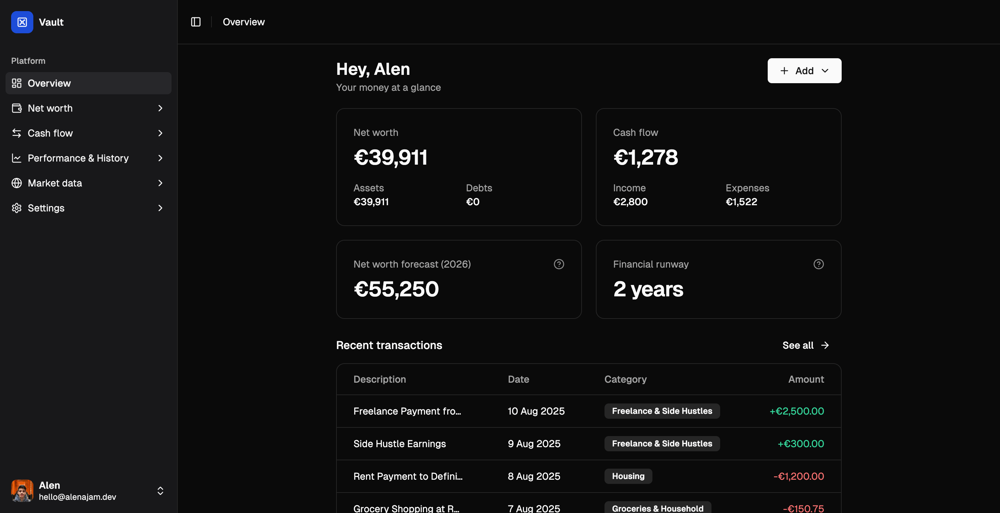
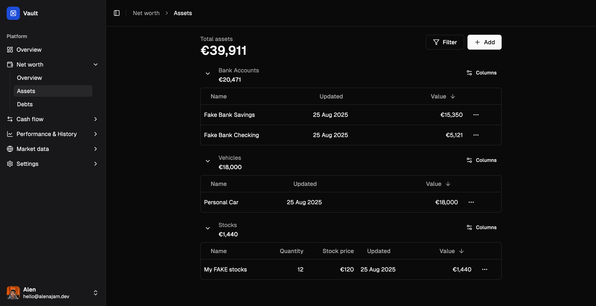
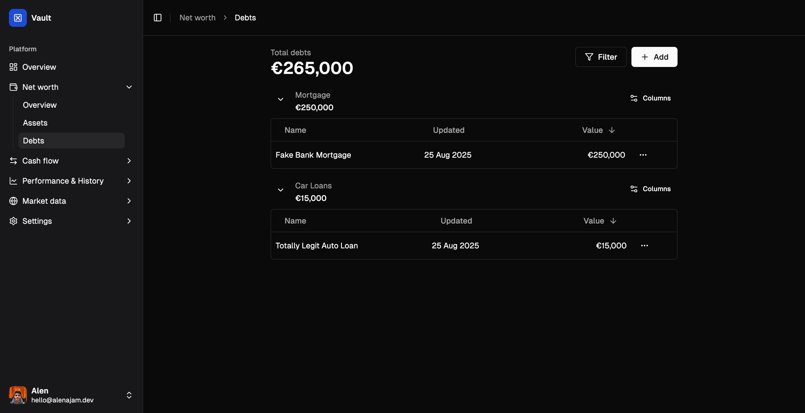
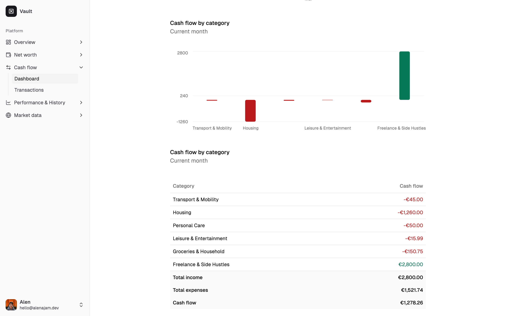
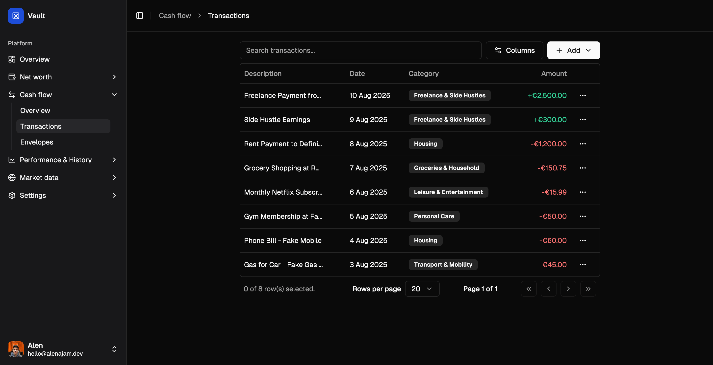

<h1 align="center">
  Vault
</h1>

<h4 align="center">A simple yet powerful personal finance app</h4>

<p align="center">
  
</p>



Vault helps you track **net worth**, **cash flow**, and **expenses** in a simple and effective way. Vault is an evolving project, with planned features like **multi-currency support**, **real-time exchange rates**, and **stock tracking**.

## 📌 Table of Contents

- [Key Features](#-key-features)
- [Getting Started](#getting-started)
- [Tech Stack](#tech-stack)
  - [Core Technologies](#core-technologies)
  - [UI & Components](#ui--components)
- [Screenshots](#-screenshots)
- [Who's Behind This?](#-whos-behind-this)
- [License](#-license)

## ✨ Key Features

- **Net Worth Tracking** – A simple way to see assets and liabilities in one place.
- **Cash Flow Insights** – A glance at how money moves over time.
- **Expense Tracking** – A lightweight way to keep an eye on spending.
- **Multi-Currency Support** – Potential support for different currencies.
- **Stock & Crypto Tracking** – Basic market tracking for stocks and crypto.
- **Slick UI** – A clean and modern interface.
- **Dark Mode Support** – Optimized for both light and dark themes.

## Getting Started

Here’s how you can get Vault up and running.

### Prerequisites

Make sure you have the following installed:

- 🏗️ [Node.js](https://nodejs.org/) (Required: v22.13.1)
- 📦 [npm](https://www.npmjs.com/) (Vault uses `npm@10.9.2`)
- 🗄️ [MySQL](https://www.mysql.com/)
- 🐳 [Docker](https://www.docker.com/) (If you want to use the included DB spin up script)

### Installation

Clone the repository and install dependencies:

```sh
git clone https://github.com/oxcened/vault.git
cd vault
npm install
```

### Environment Variables

Before running the project, create a `.env` file in the root directory. You can use `.env.example` as a reference:

```sh
cp .env.example .env
```

Then, open `.env` and fill in the required secrets and configuration values.

### Authentication

Vault utilizes **Discord OAuth** for authentication, integrated with NextAuth.js.  
To set it up, follow these steps:

1. Go to the [Discord Developer Portal](https://discord.com/developers/applications).
2. Create a new application.
3. Under **OAuth2**, add a redirect URI matching:
   ```
   http://localhost:3000/api/auth/callback/discord
   ```
4. Copy the **Client ID** and **Client Secret** from the OAuth2 settings.
5. In your `.env` file, add the following:

   ```sh
   AUTH_DISCORD_ID=your-client-id
   AUTH_DISCORD_SECRET=your-client-secret
   ```

6. Restart the development server with:

   ```sh
   npm run dev
   ```

For more details, check out [T3 Authentication Guide](https://create.t3.gg/en/usage/first-steps#authentication).

### Database Setup

For local development, you can spin up a MySQL database in a Docker container by running:

```sh
./start-database.sh
```

Initialize the database schema with:

```sh
npm run db:push
```

To apply migrations, use:

```sh
npm run db:migrate
```

You can also generate Prisma types:

```sh
npm run db:generate
```

### Development

Start the development server:

```sh
npm run dev
```

### Linting & Formatting

Check for linting errors:

```sh
npm run lint
```

Format code:

```sh
npm run format:write
```

### Building for Production

To build and start the production server:

```sh
npm run build
npm run start
```

Now you're ready to start using Vault!

## Tech Stack

Vault is built with the **T3 Stack**, making it scalable and efficient.

### Core Technologies:

- [TypeScript](https://www.typescriptlang.org/) – Ensuring type safety.
- [Next.js](https://nextjs.org) – Full-stack framework with SSR and API routes.
- [NextAuth.js](https://next-auth.js.org) – Secure authentication and session management.
- [Prisma](https://prisma.io) – ORM for database management.
- [Tailwind CSS](https://tailwindcss.com) – Modern styling with utility classes.
- [tRPC](https://trpc.io) – Type-safe API communication.

### UI & Components:

- [Radix UI](https://www.radix-ui.com/) with [shadcn/ui](https://ui.shadcn.com) components.
- [Lucide Icons](https://lucide.dev/) for sleek and simple icons.

## 📸 Screenshots

Here’s a quick look at Vault in action:

- **Dashboard Overview**
  

- **Assets List**
  

- **Debts List**
  

- **Cash Flow Overview**
  

- **Transactions List**
  

## 🛠 Who’s Behind This?

Built by **Alen Ajam**, who made this for personal use and decided to share it. No guarantees, but if it works for you, great!

- GitHub: [oxcened](https://github.com/oxcened)
- Email: [hello@alenajam.dev](mailto:hello@alenajam.dev)
- Website: [alenajam.dev](https://alenajam.dev)

## 📜 License

Vault is open-source and licensed under the [MIT License](https://opensource.org/licenses/MIT).  
Want to contribute? PRs are always welcome!
