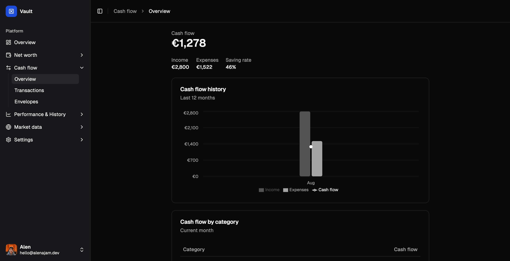

<h1 align="center">
  Vault
</h1>

<h4 align="center">A simple yet powerful personal finance app</h4>

<p align="center">
  
</p>


Vault helps you track **net worth**, **cash flow**, and **expenses** in a simple and effective way. Vault is an evolving project, with planned features like **multi-currency support**, **real-time exchange rates**, and **stock tracking**.

## 📌 Table of Contents

- [Key Features](#-key-features)
- [Quick Start](#-quick-start)
  - [Prerequisites](#prerequisites)
  - [Spin up the dev server](#spin-up-the-dev-server)
- [Other scripts](#other-scripts)
- [Tech Stack](#tech-stack)
  - [Core Technologies](#core-technologies)
  - [UI & Components](#ui--components)
- [Screenshots](#-screenshots)
- [Reactive Architecture](#-reactive-architecture)
- [Who's Behind This?](#-whos-behind-this)
- [License](#-license)

## ✨ Key Features

- **Net Worth Tracking** – A simple way to see assets and liabilities in one place.
- **Cash Flow Insights** – A glance at how money moves over time.
- **Expense Tracking** – A lightweight way to keep an eye on spending.
- **Multi-Currency Support** – Potential support for different currencies.
- **Stock & Crypto Tracking** – Basic market tracking for stocks and crypto.
- **Slick UI** – A clean and modern interface.
- **Dark Mode** – Optimized for both light and dark themes.
- **Multi-User** – Log in using Discord and manage your own finances.

## 🚀 Quick Start

### Prerequisites

Make sure you have the following installed:

- 🏗️ [Node.js](https://nodejs.org/) (Required: v22.13.1)
- 📦 [npm](https://www.npmjs.com/) (Vault uses `npm@10.9.2`)
- 🐳 [Docker](https://www.docker.com/) (If you want to use the included DB spin up script)

### Spin up the dev server

Here’s what you need to do to get started quickly:

1. **Clone the project**

   ```sh
   git clone https://github.com/oxcened/vault.git
   cd vault
   ```

2. **Create a `.env` file** using the provided example:

   ```sh
   cp .env.example .env
   ```

3. **Generate an authentication secret**:

   ```sh
   npx auth secret
   ```

   Open `.env`, locate the `AUTH_SECRET` field, and paste the generated secret.

4. **Set up Discord authentication**:

   1. Go to the [Discord Developer Portal](https://discord.com/developers/applications).
   2. Create a new application.
   3. Under **OAuth2**, add a redirect URI matching:

   ```
   http://localhost:3000/api/auth/callback/discord
   ```

   4. Copy the **Client ID** and **Client Secret** from the OAuth2 settings.
   5. In your `.env` file, paste them in `AUTH_DISCORD_ID` and `AUTH_DISCORD_SECRET`.

5. **Configure the database**:

   - Fill `DATABASE_URL` and `DATABASE_DIRECT_URL` with your database connection details.
   - If you don’t have a database, run:
     ```sh
     ./start-database.sh
     ```
     _(Requires Docker to be installed)_

6. **Install dependencies**:

   ```sh
   npm install
   ```

7. **Apply migrations and generate the Prisma client**:

   ```sh
   npm run db:generate
   ```

8. **Run the app**:
   ```sh
   npm run dev
   ```

Now, you’re ready to start using Vault!

## Other scripts

### Linting & Formatting

Check for linting errors:

```sh
npm run lint
```

Format code:

```sh
npm run format:write
```

### Building for Production

To build and start the production server:

```sh
npm run build
npm run start
```

## Tech Stack

Vault is built with the **T3 Stack**, making it scalable and efficient.

### Core Technologies:

- [TypeScript](https://www.typescriptlang.org/) – Ensuring type safety.
- [Next.js](https://nextjs.org) – Full-stack framework with SSR and API routes.
- [NextAuth.js](https://next-auth.js.org) – Secure authentication and session management.
- [Prisma](https://prisma.io) – ORM for database management.
- [Tailwind CSS](https://tailwindcss.com) – Modern styling with utility classes.
- [tRPC](https://trpc.io) – Type-safe API communication.

### UI & Components:

- [Radix UI](https://www.radix-ui.com/) with [shadcn/ui](https://ui.shadcn.com) components.
- [Lucide Icons](https://lucide.dev/) for sleek and simple icons.

## 📸 Screenshots

Here’s a quick look at Vault in action:

- **Dashboard Overview**
  

- **Assets List**
  

- **Debts List**
  

- **Cash Flow Overview**
  

- **Transactions List**
  

## 🧠 Reactive Architecture

This app uses a fully reactive, event-driven architecture to keep derived financial data accurate and efficient. Here's how it works:

### Event-Driven Data Flow

Whenever core data changes — like assets, debts, transactions, stock prices, or exchange rates — the system emits events that represent **facts** about what happened. These events are handled by dedicated listeners that determine whether and how to trigger updates to derived data.

**Example event types:**

- `asset:updated`
- `debt:updated`
- `transaction:updated`
- `exchangeRate:updated`
- `stockPrice:updated`

### Derived Data & Smart Recomputes

Derived data (like Net Worth or Cash Flow) is not recomputed blindly. Instead:

- **Shared data changes** (e.g. stock prices, exchange rates) trigger recomputes **only for affected snapshots**, based on a `DerivedDataDependency` table.
- **User-specific changes** (assets, debts, transactions) use smart recompute functions like:
  - `recomputeNetWorthForUserFrom(...)`
  - `recomputeCashFlowForUserFrom(...)`

These functions only recompute data from the earliest relevant timestamp forward.

### Dependency Graph

Every derived data snapshot tracks the specific inputs it used:

- Exchange rates
- Stock prices

This allows:

- ✅ Precise invalidation when inputs change
- ✅ No over-computation
- ✅ Full traceability of what influenced what

## 🛠 Who’s Behind This?

Built by **Alen Ajam**, who made this for personal use and decided to share it. No guarantees, but if it works for you, great!

- GitHub: [oxcened](https://github.com/oxcened)
- Email: [hello@alenajam.dev](mailto:hello@alenajam.dev)
- Website: [alenajam.dev](https://alenajam.dev)

## 📜 License

Vault is open-source and licensed under the [MIT License](https://opensource.org/licenses/MIT).  
Want to contribute? PRs are always welcome!
